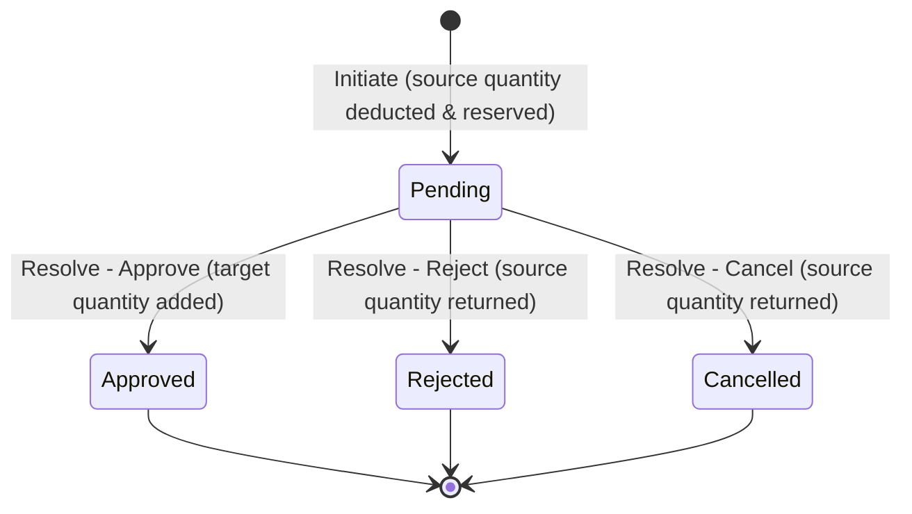

# Architecture Documentation - Vendora POS Pro

This document describes the architectural layout, patterns, and structure of the **Vendora POS Pro** SaaS Platform.

---

## 1. Hierarchical Multi-Tenant Structure

Vendora POS Pro uses a **hierarchical multi-tenant** structure:

```
SuperAdmin (Platform Owner)
   └── BusinessOwner (Can own multiple Businesses)
         ├── Business A (Tenant A)
         │     ├── Branch A1 -> Staff (Managers, Cashiers)
         │     └── Branch A2 -> Staff (Managers, Cashiers)
         ├── Business B (Tenant B)
         │     └── Branches -> Staff (Managers, Cashiers)
         └── Business C (Tenant C)
```

---

## 2. Technical Stack

*   **Frontend**: Next.js 15+ (TypeScript, Tailwind CSS, ShadCN UI)
*   **Backend**: ASP.NET Core Web API (.NET 10 SDK)
*   **Database**: PostgreSQL 18
*   **ORM**: Entity Framework Core (EF Core)

---

## 3. Backend Architecture (Clean Architecture)

The backend is organized according to **Clean Architecture** principles, dividing the system into distinct layers:

```
           [ WebApi (Presentation) ]
              /                 \
             v                   v
      [ Application ] <--- [ Infrastructure ]
             |
             /
            v
        [ Domain ]
```

### Layers:
1.  **Domain**: Contains core entities (User, Business, Branch), value objects, domain exceptions, and enums. It has no external dependencies.
2.  **Application**: Contains application logic, interfaces, DTOs, and use-case models. It depends only on the Domain.
3.  **Infrastructure**: Contains implementations of interfaces (EF Core DbContext, JWT token generator, ASP.NET Core Identity store). It depends on Application.
4.  **WebApi**: Presentation layer containing REST controllers, authorization policies, middleware, and DI wireups.

---

## 4. Tenancy & Isolation Strategy

Every tenant (Business) is assigned a unique `BusinessId`, and every branch is assigned a `BranchId`.
*   **Database Isolation**: We use a shared-database, shared-schema pattern with logical isolation via global query filters.
*   **Query Filtering**: In EF Core, global query filters are configured on all tenant-specific and branch-specific entities:
  - **Branches:**
    `builder.HasQueryFilter(b => !_tenantProvider.TenantId.HasValue || b.BusinessId == _tenantProvider.TenantId);`
  - **Users / Staff:**
    `builder.HasQueryFilter(u => !_tenantProvider.TenantId.HasValue || u.BusinessId == _tenantProvider.TenantId);`
*   **Active Tenant & Branch Scope (`ITenantProvider`)**: Resolves the active `business_id` and `branch_id` from the JWT claims of the current authenticated HTTP request context.
*   **Multi-Business Switching**:
  - A `BusinessOwner` can register multiple businesses.
  - When switching businesses, the owner calls `/api/auth/switch-business/{businessId}`.
  - The API updates the owner's active business context (`User.BusinessId`) in the database, clears the active branch context (`User.BranchId = null`), and generates a fresh JWT token containing the new `business_id` claim.
*   **Multi-Branch Context Switching**:
  - A `BusinessOwner` can switch active branch context (to view branch-specific data on the dashboard) or view all branches combined ("Global View").
  - When switching, the owner calls `/api/auth/switch-branch/{branchId}` (or `/api/auth/switch-branch/global`).
  - The API updates the owner's active branch context (`User.BranchId = branchId` or `null`), and generates a fresh JWT token containing the updated `branch_id` claim.
  - Subsequent request contexts automatically query records isolated only to the active branch (for example, staff lists query only branch users).

---

## 5. Security & Authentication

*   **Identity System**: Built on top of `Microsoft.AspNetCore.Identity` using standard tables mapped to PostgreSQL.
*   **JWT Authentication**: Tokens are signed using HMAC-SHA256.
*   **JWT Claims**:
    *   `sub` / NameIdentifier: User's Guid ID.
    *   `email`: User's email.
    *   `role`: ASP.NET Core Role name(s).
    *   `business_id`: Active Business Guid.
    *   `branch_id`: Active Branch Guid (if assigned).
*   **Role-Based Access Control (RBAC)**: Handled via standard authorization attributes and policies based on roles:
    *   `SuperAdmin`
    *   `Owner`
    *   `Manager` (Assigned to single branch, has branch claims locked)
    *   `Cashier` (Assigned to single branch, has branch claims locked, access restricted to single branch only)

---

## 6. Inventory & Stock Isolation Strategy

The inventory system supports two distinct stock control modes managed at the business/tenant level:

### Stock Modes:
1. **Shared Stock Mode (`SharedStockMode = true`)**:
   - Stock quantities are managed globally for the entire business.
   - Database records in `ProductStocks` are stored with `BranchId = null`.
   - Any query or adjustment made by branch staff will refer to the same single shared pool.
   
2. **Branch Stock Mode (`SharedStockMode = false`)**:
   - Stock quantities are managed separately for each branch.
   - Database records in `ProductStocks` are stored with `BranchId = branchId`.
   - Queries and adjustments made by branch-swapped owners or branch staff resolve only the stock assigned to that specific branch.

### Global Query Filtering & Joins:
- **ProductStock & StockAdjustmentLog Filters**:
  - Automatically isolates stock/logs to the current `BusinessId`.
  - Dynamically filters by `BranchId` if a branch context is active:
    `ps => ps.Product.BusinessId == tenantId && (ps.BranchId == null || !branchId.HasValue || ps.BranchId == branchId)`
- **Query Filter Bypass (`IgnoreQueryFilters`)**:
  - Used in audit-log queries (e.g. `StockAdjustmentLogs`) to load the modifying user/staff entity (`AdjustedByUser`) even if the user resides in a different branch context than the caller (for example, when an Owner without a branch context makes adjustments on a branch product, or a Manager views logs made by the global Owner).
  - Explicit manual filters are applied to the query after `IgnoreQueryFilters()` to preserve strict tenant boundaries and branch log security.

---

## 7. Stock Transfer System Architecture

The Stock Transfer System manages inter-branch inventory movement with atomic state transitions, strict validation rules, and double-entry adjustments logs.

### State Transitions & Inventory Lifecycle:


1. **Initiation**:
   - Source branch stock availability is verified.
   - The requested quantity is immediately deducted from the source branch (`ProductStock`) to "reserve" it, preventing double-selling.
   - An outbound adjustment log (`StockAdjustmentLog`) is written for auditing.
   - The transfer is saved in a `Pending` state.
2. **Approval**:
   - Adds the reserved stock quantity to the destination branch (`ProductStock`), creating the stock record if it doesn't already exist.
   - Writes an inbound adjustment log for auditing.
   - Transition state to `Approved`.
3. **Rejection / Cancellation**:
   - Reverses the initial reservation by adding the quantity back to the source branch (`ProductStock`).
   - Writes a return adjustment log for auditing.
   - Transition state to `Rejected` (for receiver rejection) or `Cancelled` (for sender cancellation).

### Access Rules and Constraints:
- **Shared Stock Mode Block**: Stock transfers are blocked when `SharedStockMode` is active.
- **Cashier Restriction**: Cashiers are blocked from all stock transfer operations (including details and listing).
- **Manager Scope**:
  - Outgoing Scope: Managers can only initiate or cancel transfers where the source branch matches their assigned branch.
  - Incoming Scope: Managers can only approve or reject transfers where the target branch matches their assigned branch.
  - Query Scope: Managers can only list transfers involving their branch (source or target).
- **Query Filter Bypass (`IgnoreQueryFilters`)**:
  - Relational joins (e.g., loading `SourceBranch`, `TargetBranch`, `InitiatedByUser`, or `ResolvedByUser` in `StockTransfer` listing) would normally fail or exclude records if the other branch/user is outside the Manager's active branch context.
  - We use `.IgnoreQueryFilters()` on the `StockTransfers` query and manually apply the tenant isolation (`BusinessId == tenantId`) and branch isolation filters in the controller.
