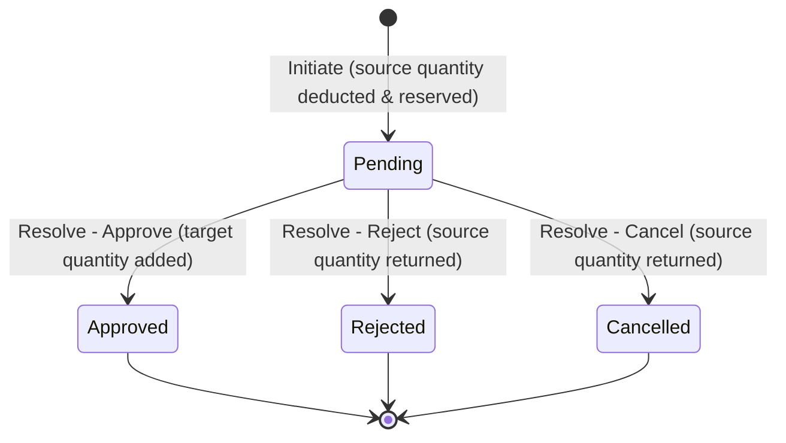

# Architecture Documentation - Vendora Inventory Management System

This document describes the architectural layout, patterns, and structure of the **Vendora Inventory Management System** SaaS Platform.

---

## 1. Hierarchical Multi-Tenant Structure

Vendora Inventory Management System uses a **hierarchical multi-tenant** structure:

```
SuperAdmin (Platform Owner)
   └── BusinessOwner (Can own multiple Businesses)
         ├── Business A (Tenant A)
         │     ├── Branch A1 -> Staff (Managers, Cashiers)
         │     └── Branch A2 -> Staff (Managers, Cashiers)
         ├── Business B (Tenant B)
         │     └── Branches -> Staff (Managers, Cashiers)
         └── Business C (Tenant C)
```

---

## 2. Technical Stack

*   **Frontend**: Next.js 15+ (TypeScript, Tailwind CSS, ShadCN UI)
*   **Backend**: ASP.NET Core Web API (.NET 10 SDK)
*   **Database**: PostgreSQL 18
*   **ORM**: Entity Framework Core (EF Core)

---

## 3. Backend Architecture (Clean Architecture)

The backend is organized according to **Clean Architecture** principles, dividing the system into distinct layers:

```
           [ WebApi (Presentation) ]
              /                 \
             v                   v
      [ Application ] <--- [ Infrastructure ]
             |
             /
            v
        [ Domain ]
```

### Layers:
1.  **Domain**: Contains core entities (User, Business, Branch), value objects, domain exceptions, and enums. It has no external dependencies.
2.  **Application**: Contains application logic, interfaces, DTOs, and use-case models. It depends only on the Domain.
3.  **Infrastructure**: Contains implementations of interfaces (EF Core DbContext, JWT token generator, ASP.NET Core Identity store). It depends on Application.
4.  **WebApi**: Presentation layer containing REST controllers, authorization policies, middleware, and DI wireups.

---

## 4. Tenancy & Isolation Strategy

Every tenant (Business) is assigned a unique `BusinessId`, and every branch is assigned a `BranchId`.
*   **Database Isolation**: We use a shared-database, shared-schema pattern with logical isolation via global query filters.
*   **Query Filtering**: In EF Core, global query filters are configured on all tenant-specific and branch-specific entities:
  - **Branches:**
    `builder.HasQueryFilter(b => !_tenantProvider.TenantId.HasValue || b.BusinessId == _tenantProvider.TenantId);`
  - **Users / Staff:**
    `builder.HasQueryFilter(u => !_tenantProvider.TenantId.HasValue || u.BusinessId == _tenantProvider.TenantId);`
*   **Active Tenant & Branch Scope (`ITenantProvider`)**: Resolves the active `business_id` and `branch_id` from the JWT claims of the current authenticated HTTP request context.
*   **Multi-Business Switching**:
  - A `BusinessOwner` can register multiple businesses.
  - When switching businesses, the owner calls `/api/auth/switch-business/{businessId}`.
  - The API updates the owner's active business context (`User.BusinessId`) in the database, clears the active branch context (`User.BranchId = null`), and generates a fresh JWT token containing the new `business_id` claim.
*   **Multi-Branch Context Switching**:
  - A `BusinessOwner` can switch active branch context (to view branch-specific data on the dashboard) or view all branches combined ("Global View").
  - When switching, the owner calls `/api/auth/switch-branch/{branchId}` (or `/api/auth/switch-branch/global`).
  - The API updates the owner's active branch context (`User.BranchId = branchId` or `null`), and generates a fresh JWT token containing the updated `branch_id` claim.
  - Subsequent request contexts automatically query records isolated only to the active branch (for example, staff lists query only branch users).

---

## 5. Security & Authentication

*   **Identity System**: Built on top of `Microsoft.AspNetCore.Identity` using standard tables mapped to PostgreSQL.
*   **JWT Authentication**: Tokens are signed using HMAC-SHA256.
*   **JWT Claims**:
    *   `sub` / NameIdentifier: User's Guid ID.
    *   `email`: User's email.
    *   `role`: ASP.NET Core Role name(s).
    *   `business_id`: Active Business Guid.
    *   `branch_id`: Active Branch Guid (if assigned).
*   **Role-Based Access Control (RBAC)**: Handled via standard authorization attributes and policies based on roles:
    *   `SuperAdmin`
    *   `Owner`
    *   `Manager` (Assigned to single branch, has branch claims locked)
    *   `Cashier` (Assigned to single branch, has branch claims locked, access restricted to single branch only)

---

## 6. Inventory & Stock Isolation Strategy

The inventory system supports two distinct stock control modes managed at the business/tenant level:

### Stock Modes:
1. **Shared Stock Mode (`SharedStockMode = true`)**:
   - Stock quantities are managed globally for the entire business.
   - Database records in `ProductStocks` are stored with `BranchId = null`.
   - Any query or adjustment made by branch staff will refer to the same single shared pool.
   
2. **Branch Stock Mode (`SharedStockMode = false`)**:
   - Stock quantities are managed separately for each branch.
   - Database records in `ProductStocks` are stored with `BranchId = branchId`.
   - Queries and adjustments made by branch-swapped owners or branch staff resolve only the stock assigned to that specific branch.

### Global Query Filtering & Joins:
- **ProductStock & StockAdjustmentLog Filters**:
  - Automatically isolates stock/logs to the current `BusinessId`.
  - Dynamically filters by `BranchId` if a branch context is active:
    `ps => ps.Product.BusinessId == tenantId && (ps.BranchId == null || !branchId.HasValue || ps.BranchId == branchId)`
- **Query Filter Bypass (`IgnoreQueryFilters`)**:
  - Used in audit-log queries (e.g. `StockAdjustmentLogs`) to load the modifying user/staff entity (`AdjustedByUser`) even if the user resides in a different branch context than the caller (for example, when an Owner without a branch context makes adjustments on a branch product, or a Manager views logs made by the global Owner).
  - Explicit manual filters are applied to the query after `IgnoreQueryFilters()` to preserve strict tenant boundaries and branch log security.

---

## 7. Stock Transfer System Architecture

The Stock Transfer System manages inter-branch inventory movement with atomic state transitions, strict validation rules, and double-entry adjustments logs.

### State Transitions & Inventory Lifecycle:


1. **Initiation**:
   - Source branch stock availability is verified.
   - The requested quantity is immediately deducted from the source branch (`ProductStock`) to "reserve" it, preventing double-selling.
   - An outbound adjustment log (`StockAdjustmentLog`) is written for auditing.
   - The transfer is saved in a `Pending` state.
2. **Approval**:
   - Adds the reserved stock quantity to the destination branch (`ProductStock`), creating the stock record if it doesn't already exist.
   - Writes an inbound adjustment log for auditing.
   - Transition state to `Approved`.
3. **Rejection / Cancellation**:
   - Reverses the initial reservation by adding the quantity back to the source branch (`ProductStock`).
   - Writes a return adjustment log for auditing.
   - Transition state to `Rejected` (for receiver rejection) or `Cancelled` (for sender cancellation).

### Access Rules and Constraints:
- **Shared Stock Mode Block**: Stock transfers are blocked when `SharedStockMode` is active.
- **Cashier Restriction**: Cashiers are blocked from all stock transfer operations (including details and listing).
- **Manager Scope**:
  - Outgoing Scope: Managers can only initiate or cancel transfers where the source branch matches their assigned branch.
  - Incoming Scope: Managers can only approve or reject transfers where the target branch matches their assigned branch.
  - Query Scope: Managers can only list transfers involving their branch (source or target).
- **Query Filter Bypass (`IgnoreQueryFilters`)**:
  - Relational joins (e.g., loading `SourceBranch`, `TargetBranch`, `InitiatedByUser`, or `ResolvedByUser` in `StockTransfer` listing) would normally fail or exclude records if the other branch/user is outside the Manager's active branch context.
  - We use `.IgnoreQueryFilters()` on the `StockTransfers` query and manually apply the tenant isolation (`BusinessId == tenantId`) and branch isolation filters in the controller.

---

## 8. Receipt Customization & Public Verification Architecture

The Receipt Customization system provides business owners and managers with tools to customize printed receipts. It also features a zero-dependency public verification page where customers or external auditors can scan a QR code to confirm a transaction's authenticity.

### Settings Customization & Inherited Fallbacks:
- **ReceiptSettings Entity**: Stores logo paths, header/footer messages, toggle flags (e.g. `ShowLogo`, `ShowQRCode`), layout styles (`Thermal` 80mm vs `A4` Invoice), and custom branding hex colors.
- **Hierarchical Fallback Resolution**: 
  - The system checks if there is a branch-level override setting for the current `BranchId`.
  - If no branch-specific setting is found, it falls back to the business-level default settings (`BranchId == null`).
  - If no settings exist for the business, default fallback settings are created dynamically.
- **RBAC Security Boundaries**:
  - **SuperAdmin**: Full read/write access.
  - **Owner**: Can create/modify the business default settings and any branch-level settings.
  - **Manager**: Strictly restricted to managing settings for their assigned branch context.
  - **Cashier**: Read-only access to render and print receipts.

### Zero-Dependency Public Verification:
- **Anonymous Endpoint (`GET /api/sales/verify/{id}`)**: Marks the request context as `[AllowAnonymous]` and runs `.IgnoreQueryFilters()` to bypass multi-tenant/branch boundaries. This allows public lookups using only the unique transaction GUID.
- **Data Security Guardrails**: The verification response uses `VerifiedSaleDto` instead of `SaleDto`. It hides sensitive fields such as `CostPrice` (profit margins) and system IDs, exposing only transaction metadata (e.g., business/branch details, cashier name, products, quantities, prices, and totals).
- **Public Frontend route (`/verify-receipt/[id]/page.tsx`)**: An unauthenticated Next.js page that displays the digital receipt details, verifying its origin directly from the database.

---

## 9. Cashier Dashboard & Sales Isolation Strategy

To protect transaction history and prevent unauthorized access to sensitive financial metrics across different staff members, the system enforces a strict data isolation boundary for the `Cashier` role:

### 1. Database-Level Sales Isolation:
* **Listing Sales (`GET /api/sales`)**: If the requesting user holds the `Cashier` role, the API filters the sales query by their user ID: `query = query.Where(s => s.UserId == currentUserId);`. This prevents cashiers from seeing sales processed by other team members at the same or other branches.
* **Detail Lookups (`GET /api/sales/{id}`)**: When retrieving details of a single transaction, the API asserts that `sale.UserId == currentUserId` for Cashiers. Attempting to access another cashier's sale returns a `403 Forbidden` response.

### 2. Cashier Statistics & Performance Metrics (`GET /api/sales/cashier-stats`):
* A cashier-scoped stats endpoint compiles daily, weekly, monthly, and lifetime sales metrics isolated strictly to the calling cashier's context.
* It aggregates transaction averages (Average Transaction Value), payment channel volumes, and computes a 7-day daily trend array.
* **Top Products sold**: Aggregates and groups items checked out by the specific cashier, returning the top 5 highest volume products.

### 3. Frontend Separation (Register vs Performance):
* The Cashier dashboard separates action workflows (barcode scanning register catalog) from analytics/history dashboards.
* Custom lightweight visualization graphs (built strictly with Tailwind CSS and HTML elements) display the cashier's daily trends and top product volumes, avoiding heavy external graphing library bundles.

---

## 10. Business Owner Dashboard & Consolidated Analytics Strategy

To provide business owners with a holistic, top-level view of their business empire across multiple separate legal entities (businesses/tenants) and branch locations, the system implements a cross-business aggregation strategy:

### 1. Global Query Filter Bypassing for Consolidated Views:
* **The Challenge**: Standard database queries on `Sale`, `Product`, `Branch`, and `User` are logically isolated by `BusinessId` via global EF Core query filters. By default, an Owner logged into Business A cannot query or aggregate data for Business B.
* **The Solution**: The `GET /api/businesses/owner-stats` endpoint executes `.IgnoreQueryFilters()` on the DbContext queries. It then explicitly restricts the query using an `IN` clause against all business IDs owned by the authenticated owner user.
* **Database Verification**: The owned business IDs are resolved by querying the `Businesses` table where `OwnerId == currentUserId`. This ensures strict multi-tenant security and guarantees that owners can never view statistics for businesses owned by other platform users.

### 2. Multi-Level Parameter Scoping:
* **Consolidated View**: If no `businessId` query parameter is provided, the API computes metrics consolidated across all owned businesses.
* **Business-Specific Scoping**: If a `businessId` query parameter is provided, the endpoint validates that the business belongs to the owner, and then scopes all KPI calculations (Revenue, Profit, ATV, Margin, Top Products, Top Cashiers, Trends) to that specific business context.
* **Branch-Specific Scoping**: If a `branchId` query parameter is provided (with a valid `businessId`), the API validates branch ownership, and scopes metrics strictly to that branch's transactions.

### 3. Core Metric Calculations:
* **Total Revenue**: Calculated as `Sum(Sale.Total)` which includes tax and discounts at the sale level.
* **Total Profit**: Calculated dynamically at the item level: `Profit = SaleItem.Total - (SaleItem.CostPrice * SaleItem.Quantity)`. This uses the historical `CostPrice` recorded in `SaleItem` at checkout time, ensuring that cost fluctuations or subsequent product updates do not alter historical reporting.
* **Average Transaction Value (ATV)**: Computed as `TotalRevenue / SalesCount`.
* **Profit Margin**: Computed as `(TotalProfit / TotalRevenue) * 100`.

### 4. Zero-Dependency Frontend Visualizations:
* All charts, trends, and leaderboard metrics in the Owner dashboard overview are rendered using native HTML/SVG and Tailwind CSS without installing external graphing libraries. This ensures minimal bundle sizes and fast loading times.
* The 7-day revenue vs profit trend uses native flex-column height ratio charts with SVG grids and tooltip hover overlays.

## 11. Super Admin Dashboard & Platform Controls Architecture

### 1. Subscription Metadata Expansion:
* The `Business` entity has been extended with metadata to support licensing and tier controls:
  * `SubscriptionTier`: Indicates the tier/plan level (e.g., "Basic", "Pro", "Enterprise").
  * `SubscriptionStatus`: Indicates the status of the subscription billing cycle (e.g., "Active", "Past Due", "Cancelled").
  * `SubscriptionPrice`: The recurring price of the plan, used for global revenue metrics.
  * `SubscriptionExpiresAt`: DateTime offset of expiration. Written as UTC via `DateTime.SpecifyKind(..., DateTimeKind.Utc)` to prevent PostgreSQL timezone conversion mismatch errors.

### 2. Business Suspension Logic:
* When a business tenant violates terms or defaults on payments, Super Admins can toggle `IsActive = false` (suspended) or `IsActive = true` (activated) on the business level.
* During user authentication (`AuthController.Login`):
  * If the user belongs to a business, a query fetch retrieves the parent `Business` record using `.IgnoreQueryFilters()` to bypass tenancy restrictions (since the user is not logged in yet).
  * If `business.IsActive` is `false`, the login pipeline is terminated immediately.
  * The server returns a `403 Forbidden` response: `new { Message = "This business account is suspended. Please contact support." }`.
  * This blocks all users (Owners, Managers, Cashiers) belonging to that tenant from obtaining a session token.

### 3. Platform Audit Trail:
* Global actions must be tracked for platform accountability. The `AuditLog` system registers platform events:
  * Domain Entity: `AuditLog.cs` with properties `Id`, `Action`, `Details`, `UserEmail`, `IpAddress`, `CreatedAt`, and `BusinessId`.
  * Service: `IAuditLogService` defines `LogAsync(...)` which writes a log record. The service is registered in the Web API dependency container (`Program.cs`) and injected into the controllers.
  * Mappings: Configured in `ApplicationDbContext.cs` to allow database storage. Audit logs bypass standard tenancy filters via `.IgnoreQueryFilters()` so Super Admins can review logs globally across all tenants.

### 4. Zero-Dependency Platform Analytics:
* Like other dashboards, the Super Admin dashboard does not use external charting libraries.
* Visualizes 7-day registration trends using a bar chart where height is dynamically styled using CSS percentages calculated from date groupings.
* Features real-time search, sorting, and inline status modification modals for subscription tier updates and suspensions.

---

## 12. Subscription Billing & Stripe Integration Architecture

### 1. Database & Domain Additions:
* **Stripe Identifiers**: Added `StripeCustomerId` and `StripeSubscriptionId` to the `Business` domain model. These link the database tenant record to the corresponding resources in the Stripe platform.

### 2. Multi-Mode Architecture (Mock Billing Mode):
* To run integration tests and local development workflows without requiring active internet connectivity or valid Stripe keys, the billing pipeline supports a **Mock Billing Mode**:
  * **Fallback Flag**: In `StripeService`, if the configuration keys `Stripe:SecretKey` are unset, set to empty, or set to `"Mock"`, the service sets `IsMockMode = true`.
  * **Simulated Redirects**: In Mock Mode, checkout and portal session requests return simulation URLs containing metadata query strings (e.g., `/success?session_id=mock_session_xxx&businessId=yyy&tier=zzz`).
  * **Webhook Verification Bypass**: The webhook processing pipeline bypasses signature checks in Mock Mode and accepts plain JSON payloads, allowing simulated webhooks to execute state transitions.

### 3. Stripe Webhook Processing Lifecycle:
* **Public Webhook Route (`POST /api/webhooks/stripe`)**: A public anonymous endpoint parses event payloads.
* **Webhook Events Handled**:
  * `checkout.session.completed`: Sets customer and subscription IDs on the business entity, configures the active tier, sets the status to `"Active"`, updates the price, and sets `SubscriptionExpiresAt` (+1 month or +1 year).
  * `invoice.payment_succeeded`: Automatically extends the expiration date based on the plan cycle price rate.
  * `invoice.payment_failed`: Transitions the business status to `"Past Due"` indicating payment delinquency.
  * `customer.subscription.updated`: Synchronizes customer portal upgrades, downgrades, or billing period shifts.
  * `customer.subscription.deleted`: Sets status to `"Cancelled"` or `"Suspended"` and sets `SubscriptionExpiresAt` to `UtcNow`.

### 4. Subscription Operational Gates:
* **Login Level blocks (Managers & Cashiers)**:
  * In `AuthController.Login`, if the user has the role of Manager or Cashier, the system checks the parent business subscription.
  * If the subscription is expired (`SubscriptionExpiresAt < DateTime.UtcNow`) or delinquent (`SubscriptionStatus` is `"Cancelled"` or `"Past Due"`), the login is blocked immediately, returning a `402 Payment Required` HTTP response code.
* **Token Claim & Warning Overlay (Owners)**:
  * Owners are allowed to log in even if their business subscription is delinquent or expired, ensuring they can access billing settings to resolve payments.
  * During token generation (`JwtTokenGenerator`), the database is queried to determine subscription validity. The `is_subscription_active` claim is appended as a boolean string claim in the JWT.
  * The frontend `AuthContext.tsx` decodes this claim and exposes it as `isSubscriptionActive` on the authenticated user profile.
  * In `owner/page.tsx`, if `isSubscriptionActive === false` and the user is not viewing the Billing tab, a glassmorphic **Subscription Expired Lock Overlay** blocks dashboard operation panels, forcing the owner to resolve their subscription.

---

## 13. Mobile & Responsive POS and Client-Side Offline Caching Architecture

To support seamless checkout operations across different devices and in environments with unstable network connectivity, the Cashier POS includes a fully responsive design and client-side offline durability structures.

### 1. Viewport-Based Layout Switching (Tailwind CSS)
* **Desktop Layout (>= 1024px)**: Uses a standard two-column layout. The left column (400px width) displays the active cart, manual discount/coupon adjustments, and subtotal/total calculations. The right column takes the remaining width and displays the product grid, barcode search input, and keyword query filters.
* **Mobile/Tablet Layout (< 1024px)**: Swaps the side-by-side columns for a single-column, tabbed panel layout.
  - **Tabs**: Toggles active views between "Browse Catalog" and "Receipt Cart".
  - **Mobile Floating Bar**: Rendered when catalog mode is active and the cart contains items. Displays a summary of selected items count and subtotal, with a quick redirect button to open the Cart page for checkout.
  - **Responsive Modals**: Modal elements (such as split payment allocations and receipt previews) wrap content in scrollable containers (`max-h-[60vh] overflow-y-auto`) to fit vertically on mobile heights.

### 2. Client-Side Catalog Cache Fallback
* **Load Caching**: When the POS mount resolves successfully, fetched product listings are stored in `localStorage` under `vendora_cached_products`.
* **Network Failover**: In `fetchProducts`, if the network request fails due to offline state or api server timeouts, the browser catches the exception and falls back to loading catalog data from the cache.

### 3. Offline Transaction Queue & Local Deduction
* **Network Error Catching**: When checkouts are submitted (`POST /api/sales`), the system intercepts fetch failures (unreachable server, user offline).
* **Simulated Checkout**: If the server is unreachable, the POS prompts the cashier to record the checkout offline:
  - Generates a simulated transaction with a temporary ID (`offline_{timestamp}`).
  - Deducts sold item quantities from `vendora_cached_products` stock balances immediately.
  - Clears active cart buffers, opens receipt preview print dialogs, and saves the transaction payload inside the `vendora_offline_sales` array in `localStorage`.
* **Sync Indicators & Synchronization**:
  - Displays a visual dot (🟢 Online / 🔴 Offline) in the POS header.
  - Displays a warning badge (`Sync Pending: X`) if offline sales are queued.
  - Clicking the badge triggers sequential asynchronous HTTP uploads of queued payloads to `/api/sales`. Once a queued sale is successfully stored on the server, it is removed from the client queue.

---

## 14. Performance Optimizations & System Hardening Architecture (Phase 18)

To ensure the multi-tenant hierarchical system scales efficiently as tenant data grows, the following hardening and optimization patterns are implemented:

### 1. Database Indexing Scheme
Explicit PostgreSQL indexes are configured in `ApplicationDbContext.OnModelCreating` to optimize query performance and join operations:
* **Foreign Key Indexes**: Placed on logical tenant lookup relations (e.g., `Branch.BusinessId`, `User.BusinessId`, `Product.CategoryId`, etc.) to speed up multi-tenant logical filtering and cascading sweeps.
* **Chronological & Status Search Indexes**: Configured on tables like `Sales.CreatedAt`, `AuditLogs.CreatedAt`, and `Notifications.SentAt` to accelerate date-range filters and timeline rendering.

### 2. Read-Only Query Optimization (`AsNoTracking`)
To eliminate Entity Framework Core change tracker overhead, all read-only GET listing and detail actions across Controllers are optimized with `.AsNoTracking()`:
* **Tracking Overhead Elimination**: Prevents EF Core from maintaining duplicate entity instances in memory and tracking state modifications, reducing memory allocation and garbage collection pauses.
* **Endpoints Configured**: `AuditLogsController` queries, `NotificationsController` list retrievals, `SuperAdminController` status reports, `SalesController` stats and histories, and `ProductsController` catalogs are updated with `.AsNoTracking()` to improve throughput.

### 3. Role Security Boundaries (RBAC Auditing)
To ensure isolation and tenant data confidentiality, access is gated through strict ASP.NET Core identity policies:
* **Cashier Restrictions**: Fully blocked from administrative and platform operations (e.g., Audit Logs, Products CRUD, SuperAdmin controls, and manual stock adjustments).
* **Manager Boundaries**: Restricted from cross-branch adjustments, product definitions CRUD, and SuperAdmin endpoints.
* **Owner Permissions**: Authorized to access business-wide audit logs, manage product properties, and configure receipt customization.

---

## 15. System Integration & Verification Testing Architecture (Phase 19)

To guarantee the long-term reliability and stability of the platform's multi-tenant boundaries, branch isolation, and checkout rules, a comprehensive integration testing architecture has been established:

### 1. Integration Test Runner
The platform utilizes a customized PowerShell automation runner (`verify_phase19_system_testing.ps1`) that interacts directly with the Web API endpoints under simulated user flows. The script tests real-world operational scenarios and security blockades in a sequential pipeline:
* **Tenant & Branch Isolation Checks**: Registers multiple independent tenants (Tenant A/B) and branches (Branch A1/A2), validating that cross-tenant read/write queries return `404 Not Found` or `403 Forbidden`.
* **RBAC Scoping Verification**: Asserts that cashier and manager users are blocked from executing unauthorized cross-branch stock modifications and sales retrievals.
* **POS & Inventory Accuracy Tests**: Validates checkout calculations, local branch stock level reductions, stock transfer reservation locks, and transfer resolution approval logic.
* **Coupon & Discount Validation**: Tests coupon threshold checks (such as minimum cart spend) and cashier discount ceiling limits (maximum 15%).
* **Subscription Operational Gating**: Verifies that expired plans correctly block cashier staff logins with `402 Payment Required` while allowing owners access with Warning overlays, and suspended business logins return `403 Forbidden`.


