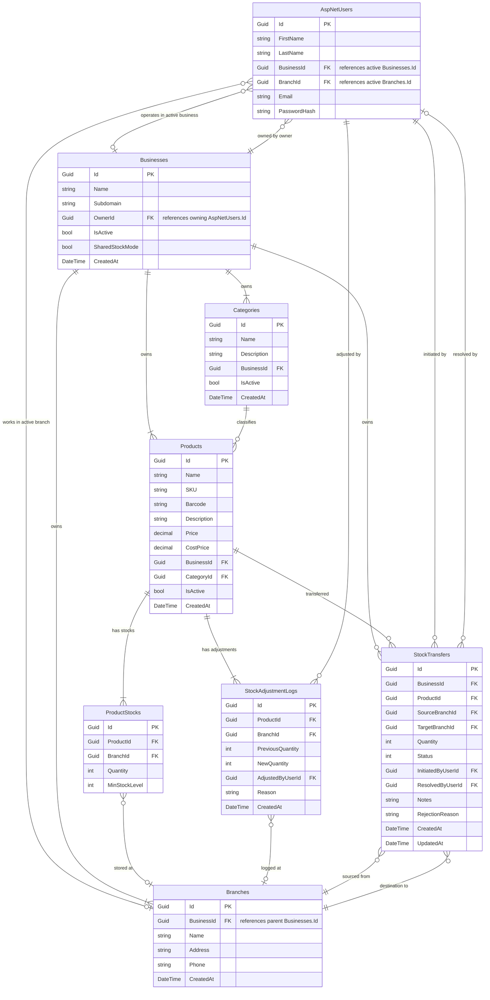

# Database Schema - Vendora POS Pro

This document maps out the database tables, relationships, and configurations for **Vendora POS Pro**.

---

## 1. Entity Relationship Overview

---

## 2. Core Tables

### `Businesses` (Tenants)
Contains the details of registered businesses (tenants). An owner user (`AspNetUsers` with role `Owner`) can own multiple records in this table.

| Column | Type | Constraints | Description |
| :--- | :--- | :--- | :--- |
| `Id` | `uuid` | `PRIMARY KEY` | Unique identifier |
| `Name` | `varchar(200)` | `NOT NULL` | Registered business name |
| `Subdomain` | `varchar(100)` | `NOT NULL, UNIQUE` | SaaS tenant subdomain |
| `OwnerId` | `uuid` | `NOT NULL` | References `AspNetUsers.Id` (Owner of the business) |
| `IsActive` | `boolean` | `NOT NULL, DEFAULT true` | Suspension / activation flag |
| `SharedStockMode` | `boolean` | `NOT NULL, DEFAULT false` | Toggle for business stock sharing mode |
| `CreatedAt` | `timestamp` | `NOT NULL` | Creation timestamp |

### `Branches`
Stores the branch locations for each business.

| Column | Type | Constraints | Description |
| :--- | :--- | :--- | :--- |
| `Id` | `uuid` | `PRIMARY KEY` | Unique identifier |
| `BusinessId` | `uuid` | `NOT NULL, FOREIGN KEY` | Owner business (`Businesses.Id`) |
| `Name` | `varchar(200)` | `NOT NULL` | Branch name |
| `Address` | `varchar(500)` | `NULL` | Physical address |
| `Phone` | `varchar(50)` | `NULL` | Contact phone number |
| `CreatedAt` | `timestamp` | `NOT NULL` | Creation timestamp |

### `AspNetUsers` (Identity Users)
Extended ASP.NET Core Identity user table.

| Column | Type | Constraints | Description |
| :--- | :--- | :--- | :--- |
| `Id` | `uuid` | `PRIMARY KEY` | Unique identifier |
| `FirstName` | `varchar(100)` | `NOT NULL` | First name |
| `LastName` | `varchar(100)` | `NOT NULL` | Last name |
| `BusinessId` | `uuid` | `NULL, FOREIGN KEY` | Active Business context (`Businesses.Id`) |
| `BranchId` | `uuid` | `NULL, FOREIGN KEY` | Active Branch context (`Branches.Id`) |
| `IsActive` | `boolean` | `NOT NULL, DEFAULT true` | User activation/deactivation status |

---

## 3. Inventory & Category Tables

### `Categories`
Classifies products within a business. Isolated via `BusinessId`.

| Column | Type | Constraints | Description |
| :--- | :--- | :--- | :--- |
| `Id` | `uuid` | `PRIMARY KEY` | Unique identifier |
| `BusinessId` | `uuid` | `NOT NULL, FOREIGN KEY` | References `Businesses.Id` |
| `Name` | `varchar(200)` | `NOT NULL` | Category name (Unique within Business) |
| `Description` | `varchar(500)` | `NULL` | Description |
| `IsActive` | `boolean` | `NOT NULL, DEFAULT true` | Soft delete flag |
| `CreatedAt` | `timestamp` | `NOT NULL` | Creation timestamp |

### `Products`
Catalog of products sold by a business. Isolated via `BusinessId`.

| Column | Type | Constraints | Description |
| :--- | :--- | :--- | :--- |
| `Id` | `uuid` | `PRIMARY KEY` | Unique identifier |
| `BusinessId` | `uuid` | `NOT NULL, FOREIGN KEY` | References `Businesses.Id` |
| `CategoryId` | `uuid` | `NULL, FOREIGN KEY` | References `Categories.Id` (nullable) |
| `Name` | `varchar(200)` | `NOT NULL` | Product name |
| `SKU` | `varchar(100)` | `NOT NULL` | Stock Keeping Unit (Unique within Business) |
| `Barcode` | `varchar(100)` | `NULL` | UPC/EAN Barcode (Unique within Business) |
| `Description` | `varchar(1000)` | `NULL` | Description |
| `Price` | `numeric(18,2)` | `NOT NULL` | Selling price |
| `CostPrice` | `numeric(18,2)` | `NOT NULL` | Cost price |
| `IsActive` | `boolean` | `NOT NULL, DEFAULT true` | Soft delete flag |
| `CreatedAt` | `timestamp` | `NOT NULL` | Creation timestamp |

### `ProductStocks`
Stores quantity and safety thresholds for products. Branch ID is null in shared stock mode.

| Column | Type | Constraints | Description |
| :--- | :--- | :--- | :--- |
| `Id` | `uuid` | `PRIMARY KEY` | Unique identifier |
| `ProductId` | `uuid` | `NOT NULL, FOREIGN KEY` | References `Products.Id` |
| `BranchId` | `uuid` | `NULL, FOREIGN KEY` | References `Branches.Id` (Null if shared stock mode) |
| `Quantity` | `integer` | `NOT NULL, DEFAULT 0` | Available stock quantity |
| `MinStockLevel` | `integer` | `NOT NULL, DEFAULT 0` | Reorder safety stock threshold |

> Unique Index on `(ProductId, BranchId)` guarantees a single stock tracking record per context.

### `StockAdjustmentLogs`
Audit trail of all manual intakes, adjustments, or sales that affect inventory levels.

| Column | Type | Constraints | Description |
| :--- | :--- | :--- | :--- |
| `Id` | `uuid` | `PRIMARY KEY` | Unique identifier |
| `ProductId` | `uuid` | `NOT NULL, FOREIGN KEY` | References `Products.Id` |
| `BranchId` | `uuid` | `NULL, FOREIGN KEY` | References `Branches.Id` (Null if shared stock mode) |
| `PreviousQuantity` | `integer` | `NOT NULL` | Quantity before adjustment |
| `NewQuantity` | `integer` | `NOT NULL` | Quantity after adjustment |
| `AdjustedByUserId` | `uuid` | `NOT NULL, FOREIGN KEY` | References `AspNetUsers.Id` |
| `Reason` | `varchar(250)` | `NOT NULL` | Explanation (e.g. "Loss/Damage", "Restock") |
| `CreatedAt` | `timestamp` | `NOT NULL` | Transaction timestamp |

### `StockTransfers`
Tracks stock transfers between branches within the business, maintaining full status history.

| Column | Type | Constraints | Description |
| :--- | :--- | :--- | :--- |
| `Id` | `uuid` | `PRIMARY KEY` | Unique identifier |
| `BusinessId` | `uuid` | `NOT NULL, FOREIGN KEY` | References `Businesses.Id` |
| `ProductId` | `uuid` | `NOT NULL, FOREIGN KEY` | References `Products.Id` |
| `SourceBranchId` | `uuid` | `NOT NULL, FOREIGN KEY` | References `Branches.Id` (Source) |
| `TargetBranchId` | `uuid` | `NOT NULL, FOREIGN KEY` | References `Branches.Id` (Destination) |
| `Quantity` | `integer` | `NOT NULL` | Number of items to transfer |
| `Status` | `integer` | `NOT NULL` | Status code (0=Pending, 1=Approved, 2=Rejected, 3=Cancelled) |
| `InitiatedByUserId` | `uuid` | `NOT NULL, FOREIGN KEY` | References `AspNetUsers.Id` (Sender) |
| `ResolvedByUserId` | `uuid` | `NULL, FOREIGN KEY` | References `AspNetUsers.Id` (Approver/Rejecter) |
| `Notes` | `varchar(500)` | `NULL` | Transaction description notes |
| `RejectionReason` | `varchar(500)` | `NULL` | Explanation for transfer rejection |
| `CreatedAt` | `timestamp` | `NOT NULL` | Initiation timestamp |
| `UpdatedAt` | `timestamp` | `NOT NULL` | Resolution timestamp |
