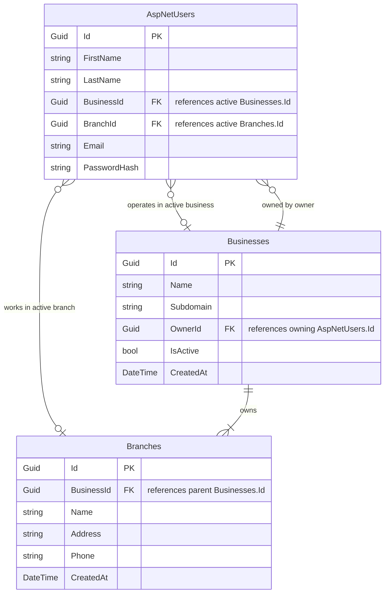

# Database Schema - Vendora POS Pro

This document maps out the database tables, relationships, and configurations for **Vendora POS Pro**.

---

## 1. Entity Relationship Overview

---

## 2. Core Tables

### `Businesses` (Tenants)
Contains the details of registered businesses (tenants). An owner user (`AspNetUsers` with role `Owner`) can own multiple records in this table (i.e., `Businesses.OwnerId` matches the owner's `AspNetUsers.Id`).

| Column | Type | Constraints | Description |
| :--- | :--- | :--- | :--- |
| `Id` | `uuid` | `PRIMARY KEY` | Unique identifier |
| `Name` | `varchar(200)` | `NOT NULL` | Registered business name |
| `Subdomain` | `varchar(100)` | `NOT NULL, UNIQUE` | SaaS tenant subdomain |
| `OwnerId` | `uuid` | `NOT NULL` | References `AspNetUsers.Id` (Owner of the business) |
| `IsActive` | `boolean` | `NOT NULL, DEFAULT true` | Suspension / activation flag |
| `CreatedAt` | `timestamp` | `NOT NULL` | Creation timestamp |

### `Branches`
Stores the branch locations for each business.

| Column | Type | Constraints | Description |
| :--- | :--- | :--- | :--- |
| `Id` | `uuid` | `PRIMARY KEY` | Unique identifier |
| `BusinessId` | `uuid` | `NOT NULL, FOREIGN KEY` | Owner business (`Businesses.Id`) |
| `Name` | `varchar(200)` | `NOT NULL` | Branch name |
| `Address` | `varchar(500)` | `NULL` | Physical address |
| `Phone` | `varchar(50)` | `NULL` | Contact phone number |
| `CreatedAt` | `timestamp` | `NOT NULL` | Creation timestamp |

### `AspNetUsers` (Identity Users)
Extended ASP.NET Core Identity user table.
- For `Owner` role: `BusinessId` represents the currently selected active business context, and `BranchId` is null.
- For `Manager` / `Cashier` roles: `BusinessId` is the business they are employed in, and `BranchId` is their assigned branch.

| Column | Type | Constraints | Description |
| :--- | :--- | :--- | :--- |
| `Id` | `uuid` | `PRIMARY KEY` | Unique identifier |
| `FirstName` | `varchar(100)` | `NOT NULL` | First name |
| `LastName` | `varchar(100)` | `NOT NULL` | Last name |
| `BusinessId` | `uuid` | `NULL, FOREIGN KEY` | Active Business context (`Businesses.Id`) |
| `BranchId` | `uuid` | `NULL, FOREIGN KEY` | Active Branch context (`Branches.Id`) |
| ... standard identity fields ... | | | |
