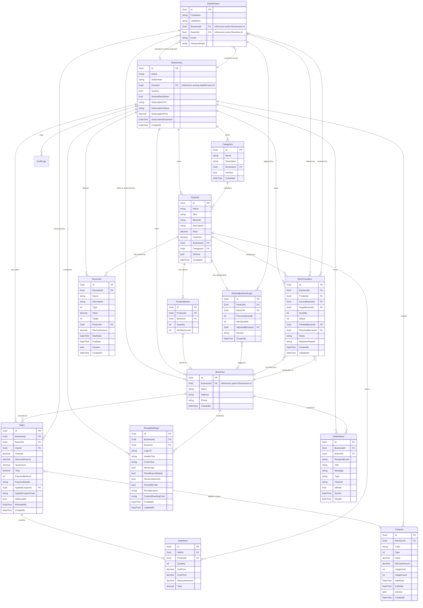

# Database Schema - Vendora POS Pro

This document maps out the database tables, relationships, and configurations for **Vendora POS Pro**.

---

## 1. Entity Relationship Overview

---

## 2. Core Tables

### `Businesses` (Tenants)
Contains the details of registered businesses (tenants). An owner user (`AspNetUsers` with role `Owner`) can own multiple records in this table.

| Column | Type | Constraints | Description |
| :--- | :--- | :--- | :--- |
| `Id` | `uuid` | `PRIMARY KEY` | Unique identifier |
| `Name` | `varchar(200)` | `NOT NULL` | Registered business name |
| `Subdomain` | `varchar(100)` | `NOT NULL, UNIQUE` | SaaS tenant subdomain |
| `OwnerId` | `uuid` | `NOT NULL` | References `AspNetUsers.Id` (Owner of the business) |
| `IsActive` | `boolean` | `NOT NULL, DEFAULT true` | Suspension / activation flag |
| `SharedStockMode` | `boolean` | `NOT NULL, DEFAULT false` | Toggle for business stock sharing mode |
| `SubscriptionTier` | `varchar(50)` | `NOT NULL, DEFAULT 'Pro'` | Subscription tier ("Standard", "Pro", "Enterprise") |
| `SubscriptionStatus` | `varchar(50)` | `NOT NULL, DEFAULT 'Active'` | Billing status ("Active", "Trialing", "PastDue", "Suspended") |
| `SubscriptionPrice` | `numeric(18,2)` | `NOT NULL, DEFAULT 299.00` | Yearly plan cost rate |
| `SubscriptionExpiresAt`| `timestamp` | `NULL` | Billing cycle expiration timestamp |
| `CreatedAt` | `timestamp` | `NOT NULL` | Creation timestamp |

### `Branches`
Stores the branch locations for each business.

| Column | Type | Constraints | Description |
| :--- | :--- | :--- | :--- |
| `Id` | `uuid` | `PRIMARY KEY` | Unique identifier |
| `BusinessId` | `uuid` | `NOT NULL, FOREIGN KEY` | Owner business (`Businesses.Id`) |
| `Name` | `varchar(200)` | `NOT NULL` | Branch name |
| `Address` | `varchar(500)` | `NULL` | Physical address |
| `Phone` | `varchar(50)` | `NULL` | Contact phone number |
| `CreatedAt` | `timestamp` | `NOT NULL` | Creation timestamp |

### `AspNetUsers` (Identity Users)
Extended ASP.NET Core Identity user table.

| Column | Type | Constraints | Description |
| :--- | :--- | :--- | :--- |
| `Id` | `uuid` | `PRIMARY KEY` | Unique identifier |
| `FirstName` | `varchar(100)` | `NOT NULL` | First name |
| `LastName` | `varchar(100)` | `NOT NULL` | Last name |
| `BusinessId` | `uuid` | `NULL, FOREIGN KEY` | Active Business context (`Businesses.Id`) |
| `BranchId` | `uuid` | `NULL, FOREIGN KEY` | Active Branch context (`Branches.Id`) |
| `IsActive` | `boolean` | `NOT NULL, DEFAULT true` | User activation/deactivation status |

### `AuditLogs`
Stores administrative and tenant transaction trail logs. Bounded by global tenant query filter.

| Column | Type | Constraints | Description |
| :--- | :--- | :--- | :--- |
| `Id` | `uuid` | `PRIMARY KEY` | Unique identifier |
| `Action` | `varchar(100)` | `NOT NULL` | Type of action (e.g. `BusinessSuspended`) |
| `Details` | `varchar(1000)` | `NOT NULL` | Description of the action |
| `UserEmail` | `varchar(256)` | `NOT NULL` | Email of user performing the action |
| `IpAddress` | `varchar(45)` | `NULL` | Requester IP address |
| `BusinessId` | `uuid` | `NULL, FOREIGN KEY` | References optional business (`Businesses.Id`) |
| `CreatedAt` | `timestamp` | `NOT NULL` | Log creation timestamp |

---

## 3. Inventory & Category Tables

### `Categories`
Classifies products within a business. Isolated via `BusinessId`.

| Column | Type | Constraints | Description |
| :--- | :--- | :--- | :--- |
| `Id` | `uuid` | `PRIMARY KEY` | Unique identifier |
| `BusinessId` | `uuid` | `NOT NULL, FOREIGN KEY` | References `Businesses.Id` |
| `Name` | `varchar(200)` | `NOT NULL` | Category name (Unique within Business) |
| `Description` | `varchar(500)` | `NULL` | Description |
| `IsActive` | `boolean` | `NOT NULL, DEFAULT true` | Soft delete flag |
| `CreatedAt` | `timestamp` | `NOT NULL` | Creation timestamp |

### `Products`
Catalog of products sold by a business. Isolated via `BusinessId`.

| Column | Type | Constraints | Description |
| :--- | :--- | :--- | :--- |
| `Id` | `uuid` | `PRIMARY KEY` | Unique identifier |
| `BusinessId` | `uuid` | `NOT NULL, FOREIGN KEY` | References `Businesses.Id` |
| `CategoryId` | `uuid` | `NULL, FOREIGN KEY` | References `Categories.Id` (nullable) |
| `Name` | `varchar(200)` | `NOT NULL` | Product name |
| `SKU` | `varchar(100)` | `NOT NULL` | Stock Keeping Unit (Unique within Business) |
| `Barcode` | `varchar(100)` | `NULL` | UPC/EAN Barcode (Unique within Business) |
| `Description` | `varchar(1000)` | `NULL` | Description |
| `Price` | `numeric(18,2)` | `NOT NULL` | Selling price |
| `CostPrice` | `numeric(18,2)` | `NOT NULL` | Cost price |
| `IsActive` | `boolean` | `NOT NULL, DEFAULT true` | Soft delete flag |
| `CreatedAt` | `timestamp` | `NOT NULL` | Creation timestamp |

### `ProductStocks`
Stores quantity and safety thresholds for products. Branch ID is null in shared stock mode.

| Column | Type | Constraints | Description |
| :--- | :--- | :--- | :--- |
| `Id` | `uuid` | `PRIMARY KEY` | Unique identifier |
| `ProductId` | `uuid` | `NOT NULL, FOREIGN KEY` | References `Products.Id` |
| `BranchId` | `uuid` | `NULL, FOREIGN KEY` | References `Branches.Id` (Null if shared stock mode) |
| `Quantity` | `integer` | `NOT NULL, DEFAULT 0` | Available stock quantity |
| `MinStockLevel` | `integer` | `NOT NULL, DEFAULT 0` | Reorder safety stock threshold |

> Unique Index on `(ProductId, BranchId)` guarantees a single stock tracking record per context.

### `StockAdjustmentLogs`
Audit trail of all manual intakes, adjustments, or sales that affect inventory levels.

| Column | Type | Constraints | Description |
| :--- | :--- | :--- | :--- |
| `Id` | `uuid` | `PRIMARY KEY` | Unique identifier |
| `ProductId` | `uuid` | `NOT NULL, FOREIGN KEY` | References `Products.Id` |
| `BranchId` | `uuid` | `NULL, FOREIGN KEY` | References `Branches.Id` (Null if shared stock mode) |
| `PreviousQuantity` | `integer` | `NOT NULL` | Quantity before adjustment |
| `NewQuantity` | `integer` | `NOT NULL` | Quantity after adjustment |
| `AdjustedByUserId` | `uuid` | `NOT NULL, FOREIGN KEY` | References `AspNetUsers.Id` |
| `Reason` | `varchar(250)` | `NOT NULL` | Explanation (e.g. "Loss/Damage", "Restock") |
| `CreatedAt` | `timestamp` | `NOT NULL` | Transaction timestamp |

### `StockTransfers`
Tracks stock transfers between branches within the business, maintaining full status history.

| Column | Type | Constraints | Description |
| :--- | :--- | :--- | :--- |
| `Id` | `uuid` | `PRIMARY KEY` | Unique identifier |
| `BusinessId` | `uuid` | `NOT NULL, FOREIGN KEY` | References `Businesses.Id` |
| `ProductId` | `uuid` | `NOT NULL, FOREIGN KEY` | References `Products.Id` |
| `SourceBranchId` | `uuid` | `NOT NULL, FOREIGN KEY` | References `Branches.Id` (Source) |
| `TargetBranchId` | `uuid` | `NOT NULL, FOREIGN KEY` | References `Branches.Id` (Destination) |
| `Quantity` | `integer` | `NOT NULL` | Number of items to transfer |
| `Status` | `integer` | `NOT NULL` | Status code (0=Pending, 1=Approved, 2=Rejected, 3=Cancelled) |
| `InitiatedByUserId` | `uuid` | `NOT NULL, FOREIGN KEY` | References `AspNetUsers.Id` (Sender) |
| `ResolvedByUserId` | `uuid` | `NULL, FOREIGN KEY` | References `AspNetUsers.Id` (Approver/Rejecter) |
| `Notes` | `varchar(500)` | `NULL` | Transaction description notes |
| `RejectionReason` | `varchar(500)` | `NULL` | Explanation for transfer rejection |
| `CreatedAt` | `timestamp` | `NOT NULL` | Initiation timestamp |
| `UpdatedAt` | `timestamp` | `NOT NULL` | Resolution timestamp |

---

## 4. Sales & Transactions Tables

### `Sales`
Stores transaction headers for all branch/business sales.

| Column | Type | Constraints | Description |
| :--- | :--- | :--- | :--- |
| `Id` | `uuid` | `PRIMARY KEY` | Unique identifier |
| `BusinessId` | `uuid` | `NOT NULL, FOREIGN KEY` | References `Businesses.Id` |
| `BranchId` | `uuid` | `NULL, FOREIGN KEY` | References `Branches.Id` (Null if SharedStockMode is active) |
| `UserId` | `uuid` | `NOT NULL, FOREIGN KEY` | References `AspNetUsers.Id` (Cashier/Manager) |
| `Subtotal` | `numeric(18,2)` | `NOT NULL` | Sale subtotal before discounts |
| `DiscountAmount` | `numeric(18,2)` | `NOT NULL` | Applied discount amount |
| `TaxAmount` | `numeric(18,2)` | `NOT NULL` | Applied tax amount |
| `Total` | `numeric(18,2)` | `NOT NULL` | Final checkout total |
| `PaymentMethod` | `integer` | `NOT NULL` | Payment method enum (0=Cash, 1=Card, 2=Mixed) |
| `PaymentDetails` | `varchar(1000)` | `NULL` | JSON metadata for split payments |
| `AppliedCouponId` | `uuid` | `NULL, FOREIGN KEY` | References `Coupons.Id` |
| `AppliedCouponCode` | `varchar(50)` | `NULL` | Audit copy of the coupon code used |
| `IsRefunded` | `boolean` | `NOT NULL, DEFAULT false` | Indicates if the transaction was refunded |
| `RefundedAt` | `timestamp` | `NULL` | Timestamp of refund processing |
| `CreatedAt` | `timestamp` | `NOT NULL` | Sale creation timestamp |

### `SaleItems`
Stores line items for each transaction.

| Column | Type | Constraints | Description |
| :--- | :--- | :--- | :--- |
| `Id` | `uuid` | `PRIMARY KEY` | Unique identifier |
| `SaleId` | `uuid` | `NOT NULL, FOREIGN KEY` | References `Sales.Id` (Cascade delete) |
| `ProductId` | `uuid` | `NOT NULL, FOREIGN KEY` | References `Products.Id` (Restrict delete) |
| `Quantity` | `integer` | `NOT NULL` | Number of items purchased |
| `UnitPrice` | `numeric(18,2)` | `NOT NULL` | Unit price at purchase time |
| `CostPrice` | `numeric(18,2)` | `NOT NULL` | Cost price captured at purchase time |
| `DiscountAmount` | `numeric(18,2)` | `NOT NULL` | Line-item specific discount |
| `Total` | `numeric(18,2)` | `NOT NULL` | Final line total |

---

## 5. Promotions & Discounts Tables

### `Discounts`
Stores active promotion campaigns linked to products or order rules.

| Column | Type | Constraints | Description |
| :--- | :--- | :--- | :--- |
| `Id` | `uuid` | `PRIMARY KEY` | Unique identifier |
| `BusinessId` | `uuid` | `NOT NULL, FOREIGN KEY` | References `Businesses.Id` |
| `Name` | `varchar(200)` | `NOT NULL` | Name of the discount |
| `Description` | `varchar(500)` | `NULL` | Description of the discount |
| `Type` | `integer` | `NOT NULL` | DiscountType enum (0=Percentage, 1=FixedAmount) |
| `Value` | `numeric(18,2)` | `NOT NULL` | Discount value (e.g. 10% or $10.00) |
| `Target` | `integer` | `NOT NULL` | DiscountTarget enum (0=Product, 1=Cart) |
| `ProductId` | `uuid` | `NULL, FOREIGN KEY` | Product targeted by discount (if any) |
| `MinCartAmount` | `numeric(18,2)` | `NULL` | Minimum spend to trigger discount |
| `StartDate` | `timestamp` | `NOT NULL` | Promotion valid from |
| `EndDate` | `timestamp` | `NOT NULL` | Promotion valid until |
| `IsActive` | `boolean` | `NOT NULL, DEFAULT true` | Active flag |
| `CreatedAt` | `timestamp` | `NOT NULL` | Creation timestamp |

### `Coupons`
Stores business-specific coupon codes with usage limits.

| Column | Type | Constraints | Description |
| :--- | :--- | :--- | :--- |
| `Id` | `uuid` | `PRIMARY KEY` | Unique identifier |
| `BusinessId` | `uuid` | `NOT NULL, FOREIGN KEY` | References `Businesses.Id` |
| `Code` | `varchar(50)` | `NOT NULL` | Promo code string (Unique within Business) |
| `Type` | `integer` | `NOT NULL` | DiscountType enum (0=Percentage, 1=FixedAmount) |
| `Value` | `numeric(18,2)` | `NOT NULL` | Promo value |
| `MinCartAmount` | `numeric(18,2)` | `NULL` | Minimum spend required |
| `UsageLimit` | `integer` | `NULL` | Max allowed uses of this coupon |
| `UsageCount` | `integer` | `NOT NULL, DEFAULT 0` | Current number of times applied |
| `StartDate` | `timestamp` | `NOT NULL` | Coupon valid from |
| `EndDate` | `timestamp` | `NOT NULL` | Coupon valid until |
| `IsActive` | `boolean` | `NOT NULL, DEFAULT true` | Active flag |
| `CreatedAt` | `timestamp` | `NOT NULL` | Creation timestamp |

---

## 6. Customization & Settings Tables

### `ReceiptSettings`
Stores business and branch customizable layouts and print preferences.

| Column | Type | Constraints | Description |
| :--- | :--- | :--- | :--- |
| `Id` | `uuid` | `PRIMARY KEY` | Unique identifier |
| `BusinessId` | `uuid` | `NOT NULL, FOREIGN KEY` | References `Businesses.Id` |
| `BranchId` | `uuid` | `NULL, FOREIGN KEY` | References `Branches.Id` (Null if business default) |
| `LogoUrl` | `varchar(1000)` | `NULL` | Public path to uploaded logo image |
| `HeaderText` | `varchar(1000)` | `NULL` | Custom header note printed at top |
| `FooterText` | `varchar(1000)` | `NULL` | Custom footer note printed at bottom |
| `ShowLogo` | `boolean` | `NOT NULL, DEFAULT true` | Toggle to print logo |
| `ShowBranchDetails`| `boolean` | `NOT NULL, DEFAULT true` | Toggle to print branch info |
| `ShowCashierInfo` | `boolean` | `NOT NULL, DEFAULT true` | Toggle to print cashier name |
| `ShowQRCode` | `boolean` | `NOT NULL, DEFAULT true` | Toggle to print public receipt verification QR |
| `ReceiptLayout` | `varchar(50)` | `NOT NULL, DEFAULT 'Thermal'`| Print layout style ("Thermal" or "A4") |
| `CustomBrandingColor`| `varchar(7)`| `NULL` | Hex color code for A4/branded accents |
| `CreatedAt` | `timestamp` | `NOT NULL` | Creation timestamp |
| `UpdatedAt` | `timestamp` | `NOT NULL` | Update timestamp |

> Unique constraints: 
> - Unique index on `(BusinessId, BranchId)` restricts each context to one settings row.
> - A filtered index `IX_ReceiptSettings_BusinessId_GlobalOnly` on `BusinessId` where `"BranchId" IS NULL` ensures exactly one global defaults record per business.

---

## 7. Notifications Table

### `Notifications`
Stores low stock warning alerts, subscription reminders, and other system-generated notification records. Bounded by global tenant query filter.

| Column | Type | Constraints | Description |
| :--- | :--- | :--- | :--- |
| `Id` | `uuid` | `PRIMARY KEY` | Unique identifier |
| `BusinessId` | `uuid` | `NULL, FOREIGN KEY` | Owner business (`Businesses.Id`) |
| `BranchId` | `uuid` | `NULL, FOREIGN KEY` | Active branch context (`Branches.Id`) |
| `RecipientEmail` | `varchar(256)` | `NOT NULL` | Notification recipient email |
| `Title` | `varchar(200)` | `NOT NULL` | Title header text |
| `Message` | `varchar(1000)` | `NOT NULL` | Content body text |
| `Type` | `varchar(50)` | `NOT NULL` | Type ("LowStock", "SubscriptionReminder", "General") |
| `Channel` | `varchar(50)` | `NOT NULL` | Dispatch channel ("Email", "SMS") |
| `IsRead` | `boolean` | `NOT NULL, DEFAULT false` | Indicates if the notification was read |
| `SentAt` | `timestamp` | `NOT NULL` | Notification creation/dispatch timestamp |
| `ReadAt` | `timestamp` | `NULL` | Timestamp of read status update |

---

## 8. Client-Side Browser Storage (Offline Cache & Queue)

To support offline-ready POS workflows, the frontend app utilizes the browser's `localStorage` API for caching the products catalog and queuing offline sales.

### A. Cached Catalog (`vendora_cached_products`)
Key: `vendora_cached_products`
Format: JSON Array of Product Objects.
Stored Fields:
- `id` (uuid)
- `name` (string)
- `sku` (string)
- `barcode` (string, nullable)
- `price` (numeric)
- `totalStock` (integer)
- `categoryName` (string)
- `underStockAlert` (boolean)

### B. Offline Sales Queue (`vendora_offline_sales`)
Key: `vendora_offline_sales`
Format: JSON Array of Sale Objects.
Stored Fields:
- `id` (string, temporary format: `offline_{timestamp}`)
- `isOffline` (boolean, always `true`)
- `branchName` (string)
- `cashierName` (string)
- `createdAt` (timestamp string)
- `subtotal` (numeric)
- `discountAmount` (numeric)
- `taxAmount` (numeric)
- `total` (numeric)
- `paymentMethod` (string)
- `paymentDetails` (string, JSON payload representing mixed collections)
- `items` (Array of item details: `productId`, `productName`, `sku`, `quantity`, `unitPrice`, `total`)

