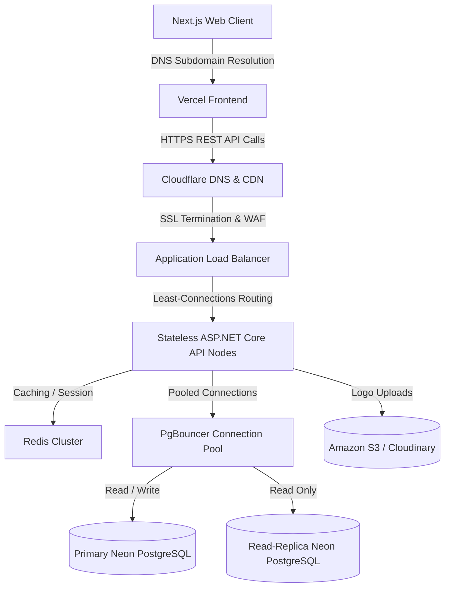

# Production Deployment Playbook & Scaling Plan - Vendora Inventory Management System

This document contains step-by-step instructions for deploying **Vendora Inventory Management System** to production, managing environment variables, running database migrations, and scaling the system to support thousands of active tenants.

---

## 1. Infrastructure Overview

The production architecture maps the multi-tenant hierarchical layout to a modern, serverless, and auto-scaling cloud structure:



### Hosting Recommendations
*   **Frontend**: [Vercel](https://vercel.com) (optimized for Next.js, built-in edge caching, and wildcards support for multi-tenant subdomains).
*   **Backend Web API**: [Render](https://render.com) (Web Service using Docker) or a VPS/AWS App Runner cluster.
*   **Database**: [Neon PostgreSQL](https://neon.tech) (Serverless Postgres with instant branching, auto-scaling compute, and built-in PgBouncer pooling).
*   **Object Storage**: [AWS S3](https://aws.amazon.com/s3) or [Cloudinary](https://cloudinary.com) (for receipts logo uploads).
*   **Caching**: [Upstash Redis](https://upstash.com) or AWS ElastiCache (serverless Redis).

---

## 2. Environment Variables Specification

### A. Frontend (Next.js)
Place these environment variables inside the Vercel dashboard or local production build parameters:

| Variable | Description | Example Value |
| :--- | :--- | :--- |
| `NEXT_PUBLIC_API_URL` | Production Web API root URL | `https://api.vendorapos.pro` |
| `NEXT_PUBLIC_STRIPE_PUBLISHABLE_KEY`| Stripe publishable api key | `pk_live_51...` |

> [!IMPORTANT]
> **Subdomain Wildcards Configuration**:
> To support dynamic multi-tenant subdomains (e.g. `tenant1.vendorapos.pro`), configure a wildcard domain in your Vercel project settings: `*.vendorapos.pro` pointed to Vercel's CNAME.

### B. Backend (ASP.NET Core Web API)
Configure these keys inside your Render service environment panel or Docker environment configuration:

| Variable | Description | Recommended Source / Value |
| :--- | :--- | :--- |
| `ConnectionStrings__DefaultConnection` | Pooled DB connection string | `postgresql://[user]:[pwd]@[host]-pooler.neon.tech/vendora?sslmode=require` |
| `ConnectionStrings__DirectConnection`  | Direct DB connection string (for migrations) | `postgresql://[user]:[pwd]@[host].neon.tech/vendora?sslmode=require` |
| `Jwt__Secret` | Cryptographic key for signing JWTs | High-entropy random string (at least 32 bytes) |
| `Jwt__Issuer` | JWT validation issuer | `https://api.vendorapos.pro` |
| `Jwt__Audience` | JWT validation audience | `https://vendorapos.pro` |
| `Jwt__ExpiryMinutes` | Token expiry duration | `1440` (24 hours) |
| `Stripe__ApiKey` | Stripe Secret API Key | `sk_live_51...` |
| `Stripe__WebhookSecret` | Stripe webhook signing key | `whsec_...` |
| `SuperAdmin__Email` | Default Super Admin login email | `admin@vendorapos.pro` |
| `SuperAdmin__Password` | Default Super Admin password | Strong secret password |

---

## 3. Step-by-Step Deployment Guide

### A. Database Provisioning (Neon PostgreSQL)
1. Sign in to your [Neon](https://neon.tech) Console and create a new project named `vendora-pos-prod`.
2. Select PostgreSQL Version **16+**.
3. In the Neon dashboard, navigate to **Connection Details**.
4. Retrieve the **Pooled connection string** (ends with `-pooler.neon.tech`). Use this for `ConnectionStrings__DefaultConnection`.
5. Retrieve the **Direct connection string** (does not contain `-pooler`). Use this for `ConnectionStrings__DirectConnection` (this is required for running DB migrations, as PgBouncer transactional mode blocks EF schema migrations).

### B. Backend Deployment (Render Web Service via Docker)
We use a Dockerfile to package the Web API. The root contains the solution directory.

1. In Render, create a new **Web Service**.
2. Connect your GitHub repository.
3. Select **Docker** as the Runtime.
4. Set the Docker Build Context to `.`.
5. Set the Dockerfile Path to `backend/src/VendoraPOS.WebApi/Dockerfile` (or create a root Dockerfile if preferred, the built-in is set up for multi-stage building).
6. Under **Advanced Settings**, add the environment variables defined in Section 2-B.
7. Click **Deploy Web Service**.

### C. Frontend Deployment (Vercel)
1. In Vercel, create a new project and import your Git repository.
2. Select `frontend` as the root directory of the project.
3. Keep **Next.js** selected as the framework preset.
4. Under **Environment Variables**, add the variables defined in Section 2-A.
5. Click **Deploy**. Vercel will build and assign a production URL.
6. In Vercel DNS settings, configure the domain name (e.g. `vendorapos.pro`) and add the wildcard domain CNAME (`*.vendorapos.pro`).

---

## 4. Production Database Migration Playbook

Running EF Core migrations in production must be handled carefully to avoid connection timeouts and prevent schema locks. 

### Recommended Strategy: EF Migration Bundles
Instead of running `dotnet ef database update` from within a slow docker image or running migrations dynamically on startup (which fails under multiple web nodes), build a standalone migration bundle executable during build-time.

#### 1. Generate the Migration Bundle:
Run the following command locally or inside your build server:
```bash
dotnet ef migrations bundle --project backend/src/VendoraPOS.Infrastructure --startup-project backend/src/VendoraPOS.WebApi --output efbundle --self-contained -r linux-x64
```
This generates a compiled binary named `efbundle` targeted for Linux environments.

#### 2. Execute the Bundle in Production:
Run the bundle as a pre-deployment script or release phase. In Render, you can set the **Pre-Deploy Command** to:
```bash
./efbundle --connection "$ConnectionStrings__DirectConnection"
```
> [!WARNING]
> **Do NOT use Pooled Connection for Migrations**:
> Running migrations through a PgBouncer pooled connection will throw transactional exceptions. Always pass the direct connection string using the `--connection` argument.

---

## 5. Scaling Plan

As the platform scales to support 100+ businesses and thousands of daily sales, implement the following architectural enhancements:

### A. Database Connection Pooling
*   **Problem**: PostgreSQL spawns a separate OS process for every active client connection, exhausting memory under heavy concurrent user sessions.
*   **Solution**: Neon has PgBouncer built-in.
    *   Set the backend connection string to the `-pooler` domain.
    *   Configure PgBouncer to **Transaction Mode** (default in Neon).
    *   Ensure ASP.NET Core database contexts are configured with `DbContextPool` in `Program.cs` to reuse context objects:
        ```csharp
        builder.Services.AddDbContextPool<ApplicationDbContext>(options =>
            options.UseNpgsql(builder.Configuration.GetConnectionString("DefaultConnection")));
        ```

### B. Stateless Horizontal API Scaling
*   **Configuration**: Configure Render/AWS to spawn multiple container instances (nodes) behind a load balancer.
*   **Stateless Rules**:
    *   **JWTs**: Tokens are validated completely cryptographically on each node. No session state is held in memory.
    *   **CORS**: Dynamic middleware handles tenancy checks without local caches.
    *   **Audit logs**: Logs are piped directly to the Postgres DB or a centralized log management provider (e.g. Datadog, ELK).

### C. Cloud Object Storage for Media Files
Currently, customize receipt logo uploads are written locally to `wwwroot/uploads`. In a multi-node horizontal cluster, logos written to Node A are invisible to Node B.

*   **Migration Plan**: Implement `IFileStorageService` to upload to AWS S3 or Cloudinary.
*   **Service Interface**:
    ```csharp
    public interface IFileStorageService
    {
        Task<string> UploadFileAsync(Stream fileStream, string fileName, string contentType);
    }
    ```
*   **AWS S3 Concrete Implementation**:
    ```csharp
    public class S3FileStorageService : IFileStorageService
    {
        private readonly IAmazonS3 _s3Client;
        private readonly string _bucketName;

        public S3FileStorageService(IAmazonS3 s3Client, IConfiguration config)
        {
            _s3Client = s3Client;
            _bucketName = config["AWS:BucketName"];
        }

        public async Task<string> UploadFileAsync(Stream fileStream, string fileName, string contentType)
        {
            var key = $"logos/{Guid.NewGuid()}_{fileName}";
            var request = new PutObjectRequest
            {
                BucketName = _bucketName,
                Key = key,
                InputStream = fileStream,
                ContentType = contentType,
                CannedACL = S3CannedACL.PublicRead
            };

            await _s3Client.PutObjectAsync(request);
            return $"https://{_bucketName}.s3.amazonaws.com/{key}";
        }
    }
    ```
*   Update `ReceiptsController` to inject `IFileStorageService` instead of writing to the local web host environment files directory.

### D. Redis Caching Layer
*   **Problem**: High frequency queries (such as product catalog lookup, low-stock notifications, and tenant configuration files) add query overhead to the database.
*   **Solution**: Deploy a serverless Redis cluster.
    *   **Tenant Metadata Cache**: Cache business details and active subscription states (expires in 1 hour, cleared immediately on subscription webhook updates).
    *   **POS Catalog Cache**: Cache product catalog details. When cashiers load their dashboards, load items from Redis.
    *   **Cache Invalidation**: Hook entity creation/updates (e.g. Products updates, Stock Adjustments) to invalidate catalog keys.

### E. Database Read-Replicas for Analytics
*   **Problem**: Phase 12 dashboard metrics analytics perform intense queries (`SUM`, `AVG`, `IgnoreQueryFilters`) that slow down operational POS checkouts.
*   **Solution**: Provision a Neon database read-replica.
    *   Configure a read-only connection string `ConnectionStrings__ReadOnlyConnection`.
    *   Update `BusinessesController.GetOwnerDashboardStats` to instantiate a secondary DbContext utilizing the read-only connection string, routing analytical loads away from the primary checkout DB database.
